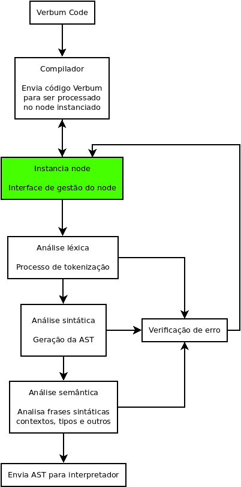
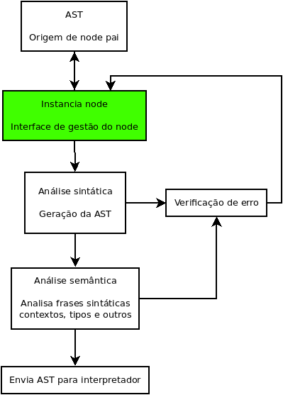
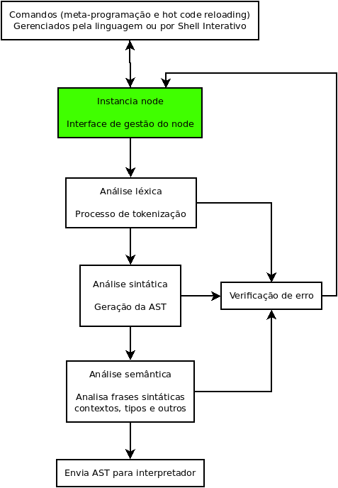

### :arrow_right: Fluxo de execução do código Verbum no interpretador.

#### Execução a partir de código Verbum:

    

 

#### Execução a partir de AST compartilhada por node pai:

    

 

#### Execução a partir de Shell interativo, ou recursos da linguagem:

    

