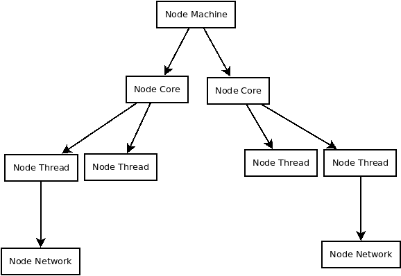

### :arrow_right: Noções do processo de execução.

#### Noções gerais

- Inicia execução.
- Cria N threads, 1 para cada Core da CPU.
- Estabelece o core 1 como Supervisor (da infraestrutura).
- Inicia a execução do programa a partir do Supervisor.
```
Código síncrono e assíncrono é executado na infraestrutura.
Sendo as funções assíncronas threads distribuídas entre os CPU-Core disponíveis.
```
- O node é sempre um Machine-Node
- Pode criar novos processos, e cada processo criado, inicia-se como um Machine-Node.
- Um Machine-Node pode criar outro Machine-Node, ou conectar-se em um Network-Node.
- Um Network-Node é um Machine-Node acessível via rede.


O código síncrono é executado em uma única thread, e toda vez que se cria uma função assíncrona, é criada uma nova thread.

É possível conectar/criar node dos seguintes tipos:

```
Machine-Node:
    Supervisor que possui como infraestrutura todos os Cores CPU disponíveis.
    
    Quando se cria uma função Async, é levado em consideração toda a 
    infraestrutura disponível, isto é, todos os Cores de CPU disponíveis.

    Para funções Async, as mesmas são divididas em criação de Thread-Node nos
    respectivos Cores de CPU disponíveis (de maneira distribuída para usar todo
    o recurso de modo mais homogeneo).


CPU-Core-Node:
    Supervisor que possui como infraestrutura o Core CPU em questão.
    
    Quando se cria uma função Async, é criado Thread-Node dentro do Core em questão.


Network-Node
    Todo node é também um Network-Node, pois trata-se da sua interface de comunicação
    de rede.
```

Um Thread-Node é apenas uma thread dentro de um Core de CPU, a mesma executa as funções async, ou seja, o código em si que é executado dentro de uma thread, é síncrono, isto é, se trata de uma task / tarefa.

```
Thread-Node
    Supervisor que possui como infraestrutura a própria thread em questão.

    Se trata da própria função async em si.

```


#### Comunicação

A comunicação com um Machine-Node ou Network-Node, é sempre, em geral, através da rede. Ou seja, no final das contas todos se resumem a interface/api do Network-Node. A comunicação com um node é sempre através da rede.

Para as funções assíncronas, cada uma delas é uma thread dentro de algum CPU Core da infraestrutura disponível. E a comunicação interna da linguagem se dá também através de rede. Com a diferença que é a própria linguagem que faz a gestão das portas IP, e o endereço sempre será localhost.

Quando uma função não existe dentro do escopo local do node, ele verifica se a mesma existe no node superior que o criou.

Portanto, uma função/método <b>async</b>, é sempre um node, e um node de rede.


#### Extras

Noções gerais da existẽncia dos nodes, suas camadas e tipos.

Obs: não necessariamente eles são organizados desse modo, podendo um Machine-Node gerar um Thread-Node a qualquer momento.

<br><Br>

<p align="center">
    
</p>


#### Links úteis

https://medium.com/@edytarcio/async-await-introdu%C3%A7%C3%A3o-%C3%A0-programa%C3%A7%C3%A3o-ass%C3%ADncrona-em-python-fa30d077018e
https://dart.dev/codelabs/async-await
https://en.wikipedia.org/wiki/Async/await
https://en.wikipedia.org/wiki/Futures_and_promises
https://medium.com/balta-io/nodejs-async-await-21ca3636252a
https://hexdocs.pm/elixir/1.13/Task.html
https://www.tutorialspoint.com/what-is-interprocess-communication


